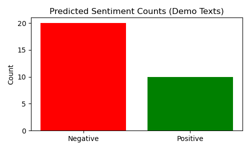

# Natural Language Processing with BERT

This project demonstrates BERT for text classification and question answering, including fine-tuning and inference.

## Motivation

I wanted to explore the power of BERT for various NLP tasks and learn how to fine-tune it for custom datasets.

## Features

- Fine-tunes BERT for sentiment classification
- Early stopping mechanism for training
- Evaluation and prediction examples
- Examples.txt file which contains demo text and its predicted class(Positive/Negative) by the model

## Dataset

- Expects a CSV file named `sentiment_data.csv` with columns: `SentimentText` (text), `Sentiment` (label: 0=negative, 1=positive) for classification.
- - The dataset is based on [Sentiment Analysis from Kaggle](https://www.kaggle.com/datasets/mdismielhossenabir/sentiment-analysis/data), which contains tweets categorized as positive or negative for sentiment analysis and model training.
- No dataset required for demo inference; demo texts are included in the script.

## Setup

```bash
pip install torch transformers pandas numpy scikit-learn
```

## Usage

-Clone repository:
```bash
git clone "https://github.com/Sat1x/BERT-Sentiment"
```

-Run:
```bash
python bert_nlp.py
```

## Outputs

- Prints accuracy and predictions for classification
- Runs a demo: predicts sentiment for a diverse set of new texts
- Saves a bar plot of predicted sentiment counts as `demo_sentiment_counts.png`

## What I Learned

- The architecture and transfer learning capabilities of BERT
- How to prepare data and fine-tune transformer models
- The importance of evaluation metrics in NLP
- How to use a fine-tuned model for inference on new, real-world examples
- Since fine tuning is still a power-hungry process, I implemented early stopping to not waste time and power, and it actually did early stop after epoch 5!

## Challenges

- Handling long input sequences and memory constraints
- Tuning hyperparameters for best performance
- Ensuring the model generalizes well to new, diverse texts

## Visualizations

The project saves one plot for the demo sentiment predictions:

**Bar plot of predicted sentiment counts:**


These help illustrate the model's ability to generalize to new, diverse examples after fine-tuning.

## Examples
Check out Examples.txt file for examples covered by the plot

## Validation Classification Report:

```
               precision    recall  f1-score   support

    Negative       0.79      0.75      0.77      2122
    Positive       0.82      0.85      0.83      2878
```

```
    accuracy                           0.81      5000
   macro avg       0.80      0.80      0.80      5000
weighted avg       0.81      0.81      0.81      5000
```

## License

MIT